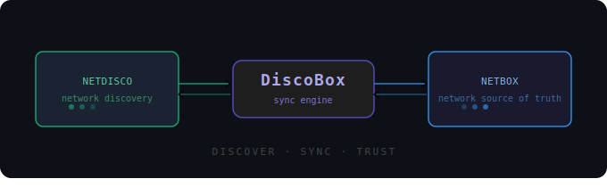

# discobox


Syncs network device inventory from [Netdisco](https://github.com/netdisco/netdisco) into [Netbox](https://netbox.dev/), enriching existing Netbox device records with live data discovered by Netdisco.

Devices are matched by management IP. Hostnames are verified and a warning is logged on mismatch, but the sync proceeds regardless.

Netbox is written to directly via [pynetbox](https://github.com/netbox-community/pynetbox) for simplicity. Migration to [Netbox Diode](https://github.com/netbox-community/netbox-diode) is a future consideration once its entity coverage matures.



---

## Run Modes

discobox can be run in two modes:

### Server mode (recommended)

A FastAPI server that receives webhook calls from Netdisco after each discovery and runs syncs in the background. Exposes Prometheus metrics and a Swagger UI.

```bash
# Docker
docker compose up -d discobox

# venv
python server.py
```

### One-shot CLI

Sync a single device by IP directly from the command line. Useful for manual runs, testing, or scripting.

```bash
# Docker
docker compose run --rm cli --host 10.0.0.1

# venv
python cli.py --host 10.0.0.1
```

```
--host <IP>        Management IP of the device to sync (required)
--no-mac           Skip MAC address sync
--no-ip            Skip IP address sync
--no-modules       Skip module bay / module sync
--no-sfp           Skip SFP inventory item sync
--no-poe           Skip PoE mode sync
--housekeeping     Remove stale device bays and empty dummy interfaces
--debug            Enable debug logging
```

---

## Features

- **Device fields** — updates serial number, OS version, OS name, OS release (parsed from description)
- **Interfaces** — creates and updates all physical and logical interfaces; maps interface type by name prefix; links subinterfaces (e.g. `Gi0/0/1.100`) to their parent interface
- **PoE** — sets `poe_mode = pse` on ports reported as PoE-capable by Netdisco
- **MAC addresses** — creates `dcim.mac-addresses` objects and links them as primary MAC per interface (Netbox 4.x model)
- **IP addresses** — assigns interface IPs; fixes prefix mismatches (e.g. `/32` → `/26`); moves IPs from dummy placeholder interfaces to the correct one
- **Module bays & modules** — models physical chassis members as module bays with installed modules; assigns interfaces to their parent module
- **Blades** — models linecards, supervisors, and fabric modules as module bays on the device they belong to (routed per VSS member for split chassis)
- **Device type auto-creation** — creates manufacturer, device type (with part number and slug) if not present in Netbox
- **SFP / transceiver inventory** — creates inventory items for transceivers with serial numbers, linked to their interface
- **PSU inventory** — creates inventory items for power supplies
- **HA / VIP detection** — detects cluster VIPs by hostname mismatch; redirects sync to the real active node; creates a Virtual Chassis linking both HA members; optionally deletes the VIP device (housekeeping)
- **Housekeeping** — removes stale device bays auto-created from DeviceType templates (e.g. `PS-A`, `Fan 1`, `Slot 1`) and deletes empty dummy interfaces

---

## Supported Topologies

| Topology | Detection | Netbox model |
|---|---|---|
| **Standalone** | Single chassis, no stack root | Updates `device_type` directly on the device |
| **Traditional stack** (e.g. Cisco 3850) | `class=stack` root present | Module bay + module per stack member; interfaces linked to their member's module |
| **Nexus FEX** (e.g. N9K-C93180LC-EX) | Stack root type `cevContainerNexusLogicalFabric` | Primary N9K updates `device_type`; each FEX unit becomes a module bay + module; FEX interfaces linked to their FEX module |
| **Cat9500 / Cat9600 StackWise Virtual** | Stack root type contains `VirtualStack` or name contains `Virtual Stack` | Two separate Netbox devices linked via Virtual Chassis; each gets its own blades and device type; partner found by serial or hostname (`-2` suffix) |
| **HA pair / VIP** (e.g. Fortinet) | SNMP hostname differs from Netbox device found by IP, or hostname contains `p1h`/`p2h`, `node1`/`node2`, or `-1`/`-2` | Virtual Chassis created linking both physical nodes and the VIP device (p0h). Management VIP IP stays on the VIP device record; interface VIPs are assigned to whichever physical node syncs first. All shared IPs get `role=vip`. Behaviour of the VIP device is controlled by `DISCOBOX_VIP_MODE` (see Configuration). |
| **Modular chassis** (e.g. N9K-C9508, C9606R) | Standalone with `class=module` blade entries | Blades (linecards, supervisors, fabric modules) modelled as module bays |

---

## Netbox Mapping

### Device

| Netdisco field | Netbox field |
|---|---|
| `serial` | `serial` |
| `os_ver` | `custom_fields.os_version` |
| `os` | `custom_fields.os_name` |
| OS release (parsed from `description`) | `custom_fields.os_release` |
| Chassis `model` | `device_type.model` |
| Chassis `type` (vendor prefix) | `device_type.manufacturer` |

### Interfaces

| Netdisco field | Netbox field |
|---|---|
| `port` / `descr` | `name` |
| Interface name prefix | `type` (e.g. `10gbase-x-sfpp`, `lag`, `virtual`) |
| `speed` | `speed` (kbps) |
| `duplex` | `duplex` |
| `description` | `description` |
| `up` | `enabled` |
| `mac` | `dcim.mac-addresses` → `primary_mac_address` |

### IP Addresses

| Netdisco field | Netbox field |
|---|---|
| `alias` / `ip` + `subnet` | `ipam.ip-addresses.address` (CIDR) |
| Interface port name | `assigned_object` (dcim.interface) |

### Module Bays & Modules

| Netdisco field | Netbox field |
|---|---|
| Chassis `name` | Module bay `name` |
| Chassis `pos` | Module bay `position` |
| Chassis `model` | Module type `model` / `part_number` |
| Chassis `serial` | Module `serial` |
| Chassis `type` vendor prefix | Module type manufacturer |

### Blades (Linecards / Supervisors)

| Netdisco field | Netbox field |
|---|---|
| Module `name` | Module bay `name` |
| Slot number (from `name`) | Module bay `position` |
| Module `model` | Module type `model` / `part_number` |
| Module `serial` | Module `serial` |

### SFP / Transceivers

| Netdisco field | Netbox field |
|---|---|
| Module `name` (expanded) | Inventory item `name` + interface link |
| Module `model` | Inventory item `part_id` |
| Module `serial` | Inventory item `serial` |

---

## Configuration

Copy `.env.example` to `.env` and fill in the values:

```env
NETDISCO_URL=https://netdisco.example.com
NETDISCO_USERNAME=admin
NETDISCO_PASSWORD=secret
NETBOX_URL=https://netbox.example.com
NETBOX_TOKEN=your-token-here

# Server mode
DISCOBOX_PORT=8080          # default: 8080
DISCOBOX_WORKERS=4          # uvicorn worker count, default: 4
DISCOBOX_AUTH_TOKEN=secret  # bearer token for /sync; leave unset to disable auth

# Sync feature defaults (server mode) — can be overridden per-request
DISCOBOX_NO_MAC=true        # disable MAC sync globally
DISCOBOX_NO_IP=true         # disable IP sync globally (e.g. if Netdisco is not VRF-aware)
DISCOBOX_NO_MODULES=true    # disable module bay sync globally
DISCOBOX_NO_SFP=true        # disable SFP inventory sync globally
DISCOBOX_NO_POE=true        # disable PoE sync globally
DISCOBOX_HOUSEKEEPING=true  # enable housekeeping globally

# HA / VIP device handling — controls what happens to the VIP placeholder device (e.g. p0h)
# threenode (default) — add VIP device as VC member at pos 0; management VIP IP stays on it (role=vip)
# soft               — unassign all IPs from VIP device so physical nodes can claim them; keep device
# hard               — delete VIP device entirely
# off                — do nothing
DISCOBOX_VIP_MODE=threenode
```

**venv setup:**
```bash
python3 -m venv .venv
source .venv/bin/activate
pip install -r requirements.txt
set -a && source .env && set +a
```

---

## Server Endpoints

| Endpoint | Method | Auth | Description |
|---|---|---|---|
| `/sync?host=<ip>` | GET, POST | yes | Trigger device sync |
| `/metrics` | GET | no | Prometheus metrics |
| `/health` | GET | no | Liveness check + in-flight hosts |
| `/docs` | GET | no | Swagger UI |

All sync flags are available as query parameters or JSON body fields, defaulting to the env var values:

```
POST /sync?host=10.0.0.1&housekeeping=true&sync_mac=false
POST /sync  {"host": "10.0.0.1", "housekeeping": true, "sync_mac": false}
```

Syncs run in a background thread pool. Duplicate requests for the same host are dropped while a sync is in progress. Concurrent syncs log under `discobox.<ip>` so they are distinguishable in the log stream.

---

## Netdisco Hook

Add to your Netdisco `config.yml` to trigger a sync automatically after each device discovery:

---

## Sample Log Output

<details>
<summary><strong>Traditional stack — Cisco C9300 (3-member)</strong></summary>

```
INFO     discobox  ── device 10.10.1.1
INFO     discobox  Netdisco  hostname='SWCORE01-STK.corp.example.com'  ports=167
INFO     discobox  Netbox    device='swcore01-stk.corp.example.com'  id=443
INFO     discobox  Device fields updated — serial='FOC2404H5VQ' os_name='ios-xe' os_ver=None os_release='Amsterdam'
INFO     discobox    stack (root)  'c93xx Stack'  model=C9300-24UX  serial=FOC2404H5VQ
INFO     discobox    ├── chassis  'Switch 1'  model=C9300-24UX  serial=FOC2404H5VQ
INFO     discobox    ├── chassis  'Switch 2'  model=C9300-24T  serial=FCW2352M8JP
INFO     discobox    └── chassis  'Switch 3'  model=C9300-24T  serial=FCW2352R3TN
INFO     discobox  Modules   chassis=3  topology=stack
INFO     discobox    Switch 1  C9300-24UX  serial=FOC2404H5VQ  created
INFO     discobox    Switch 2  C9300-24T  serial=FCW2352M8JP  created
INFO     discobox    Switch 3  C9300-24T  serial=FCW2352R3TN  created
INFO     discobox  Modules — updated=3 unchanged=0 errors=0
INFO     discobox  PSUs      entries: 3
INFO     discobox    PSU Switch 2 - Power Supply A  model=PWR-C1-350WAC-P  serial=DCC2344W9KR  created
INFO     discobox    PSU Switch 3 - Power Supply A  model=PWR-C1-350WAC-P  serial=DCC2344B4QM  created
INFO     discobox    PSU Switch 1 - Power Supply A  model=PWR-C1-1100WAC-P  serial=DCC2344L7FN  created
INFO     discobox  PSUs — created=3 updated=0 unchanged=0 errors=0
INFO     discobox    GigabitEthernet2/0/4                     created
INFO     discobox    Vlan653                                  created
INFO     discobox    TenGigabitEthernet1/0/12                 updated
INFO     discobox    GigabitEthernet3/0/15                    created
...
INFO     discobox    TenGigabitEthernet1/0/3.10               created
WARNING  discobox    StackPort1/1                             in Netbox but not in Netdisco
WARNING  discobox    StackPort1/2                             in Netbox but not in Netdisco
INFO     discobox  Subinterfaces — linked 1 parent(s)
INFO     discobox  Interface→Module — updated=124 unchanged=0 skipped=44
WARNING  discobox    IP 192.168.63.11/24     already in Netbox (id=2688, assigned to unassigned) — skipping
INFO     discobox    IP 172.16.56.1/26       → created on Vlan720
...
INFO     discobox  IPs — created=22 fixed=1 moved=0 unchanged=0 skipped=12 errors=0
INFO     discobox  SFPs      entries: 12
INFO     discobox    SFP Te2/1/3              model=SFP-10G-SR-S         serial=ACW2402P6SM → created
INFO     discobox    SFP Te3/1/8              model=SFP-10G-SR           serial=AGA16034T3N → created
...
INFO     discobox  SFPs — created=12 updated=0 unchanged=0 errors=0
INFO     discobox  PoE — updated=0 unchanged=24 skipped=0 errors=0
INFO     discobox  ── done 10.10.1.1  created=140 updated=26 unchanged=0 errors=0
INFO     discobox.server  Sync success for 10.10.1.1 in 214.7s
```

</details>

<details>
<summary><strong>StackWise Virtual — Cisco C9500 (2-member VSS)</strong></summary>

```
INFO     discobox.server  hook from 10.10.0.5: 10.10.2.87  queued
INFO     discobox  ── device 10.10.2.87
INFO     discobox  Netdisco  hostname='SWDIST01-VSS1.corp.example.com'  ports=106
INFO     discobox  Netbox    device='swdist01-vss1.corp.example.com'  id=507
INFO     discobox  Device fields updated — serial='FDO25031N7Q' os_name='ios-xe' os_ver=None os_release='Amsterdam'
INFO     discobox    stack (root)  'Virtual Stack'  model=  serial=
INFO     discobox    ├── chassis  'Switch 2 Chassis'  model=C9500-24Y4C  serial=FDO25031B4R
INFO     discobox    └── chassis  'Switch 1 Chassis'  model=C9500-24Y4C  serial=FDO25031N7Q
INFO     discobox  Modules   chassis=2  topology=vss
INFO     discobox    DeviceType → Cisco / C9500-24Y4C  serial=FDO25031N7Q  updated
INFO     discobox    VSS partner found by hostname 'swdist01-vss2.corp.example.com'
INFO     discobox    VSS partner DeviceType → C9500-24Y4C  serial=FDO25031B4R  updated
INFO     discobox    VirtualChassis 'SWDIST01-VSS1' — created
INFO     discobox  Modules — updated=2 unchanged=0 errors=0
...
INFO     discobox  ── done 10.10.2.87  created=0 updated=0 unchanged=105 errors=0
INFO     discobox.server  Sync success for 10.10.2.87 in 20.3s
```

</details>

<details>
<summary><strong>Modular chassis — Cisco Nexus 9508 (blades + PSUs)</strong></summary>

```
INFO     discobox.server  hook from 10.10.0.6: 10.10.3.21  queued
INFO     discobox  ── device 10.10.3.21
INFO     discobox  Netdisco  hostname='NXCORE01-DC1'  ports=570
INFO     discobox  Netbox    device='nxcore01-dc1.corp.example.com'  id=534
WARNING  discobox  Hostname mismatch for 10.10.3.21 — Netdisco='NXCORE01-DC1'  Netbox='nxcore01-dc1.corp.example.com'
INFO     discobox  Device fields updated — serial='FGE22124W6T' os_name='nx-os' os_ver=None os_release=None
WARNING  discobox    Dummy interface 'mgmt0' still has 1 IP(s) — skipping deletion
INFO     discobox  Housekeeping — deleted 0 stale device bay(s), 0 empty dummy interface(s)
INFO     discobox    chassis (root)  'Nexus9000 C9508 (8 Slot) Chassis'  type=cevChassisN9Kc9508  model=N9K-C9508  serial=FGE22124W6T
INFO     discobox    └── chassis  'Nexus9000 C9508 (8 Slot) Chassis'  model=N9K-C9508  serial=FGE22124W6T
INFO     discobox  Modules   chassis=1  topology=standalone
INFO     discobox    DeviceType → Cisco / N9K-C9508  serial=FGE22124W6T  updated
INFO     discobox  Modules — updated=1 unchanged=0 errors=0
INFO     discobox  PSUs      entries: 6
INFO     discobox    PSU PSU 1  model=N9K-PAC-3000W-B  serial=ART2216B3QN  created
INFO     discobox    PSU PSU 2  model=N9K-PAC-3000W-B  serial=ART2216C8RM  created
INFO     discobox    PSU PSU 3  model=N9K-PAC-3000W-B  serial=ART2216D5WP  created
INFO     discobox    PSU PSU 4  model=N9K-PAC-3000W-B  serial=ART2216J4TS  created
INFO     discobox    PSU PSU 5  model=N9K-PAC-3000W-B  serial=ART2213K7VP  created
INFO     discobox    PSU PSU 6  model=N9K-PAC-3000W-B  serial=DTM214009XM  created
INFO     discobox  PSUs — created=6 updated=0 unchanged=0 errors=0
INFO     discobox  Blades    entries: 12
INFO     discobox    Blade Supervisor Module 1       model=N9K-SUP-B+        serial=FOC22203T8L  created
INFO     discobox    Blade Supervisor Module 2       model=N9K-SUP-B+        serial=FOC222030S4  created
INFO     discobox    Blade 32p 40/100G Ethernet Module 1  model=N9K-X9732C-EX  serial=FOC22191Q4T  created
INFO     discobox    Blade 32p 40/100G Ethernet Module 2  model=N9K-X9732C-EX  serial=FOC21186S7K  created
INFO     discobox    Blade 32p 40/100G Ethernet Module 3  model=N9K-X9732C-EX  serial=FOC22191P5N  created
INFO     discobox    Blade 32p 40/100G Ethernet Module 4  model=N9K-X9732C-EX  serial=FOC27028M3L  created
INFO     discobox    Blade Fabric Module 2  model=N9K-C9508-FM-E  serial=FOC22191R2M  created
INFO     discobox    Blade Fabric Module 3  model=N9K-C9508-FM-E  serial=FOC21410B9R  created
INFO     discobox    Blade Fabric Module 4  model=N9K-C9508-FM-E  serial=FOC21410C4P  created
INFO     discobox    Blade Fabric Module 6  model=N9K-C9508-FM-E  serial=FOC21410D8N  created
INFO     discobox    Blade System Controller 1  model=N9K-SC-A  serial=FOC22155G3Q  created
INFO     discobox    Blade System Controller 2  model=N9K-SC-A  serial=FOC22155H7X  created
INFO     discobox  Blades — created=12 updated=0 unchanged=0 errors=0
INFO     discobox    Ethernet4/20                             created
INFO     discobox    Tunnel26                                 created
INFO     discobox    Tunnel211                                created
...
```

</details>

<details>
<summary><strong>HA pair / VIP — Fortinet (threenode mode)</strong></summary>

```
INFO     discobox  Netbox    device='fwcluster01p1h.corp.example.com'  id=24761
INFO     discobox.10.10.4.98  HA VIP device 'fwcluster01p0h.corp.example.com' added as VC member pos=0
INFO     discobox    VC member fwcluster01p1h.corp.example.com          pos=1  unchanged
INFO     discobox    VC member fwcluster01p2h.corp.example.com          pos=2  unchanged
INFO     discobox    VC member fwcluster01p0h.corp.example.com          pos=0  unchanged
INFO     discobox.10.10.4.98  HA peer VirtualChassis 'fwcluster01' — unchanged  (topology=standalone per Netdisco; VC is Netbox-side)
INFO     discobox.10.10.4.98  VIP device 'fwcluster01p0h.corp.example.com' — device_type updated
INFO     discobox.10.10.4.98  VIP device 'fwcluster01p0h.corp.example.com' — primary IP 10.10.4.97/24 role set to vip
INFO     discobox  Device fields updated — serial='FG6H0FTB24913847' os_name='fortios' os_ver=None os_release=None
```

</details>

```yaml
hooks:
  - event: discover
    action: HTTP
    url: "http://discobox:8080/sync?host=[% device.ip %]"
    method: POST
    headers:
      Authorization: "Bearer your-token"
    timeout: 30000
```
